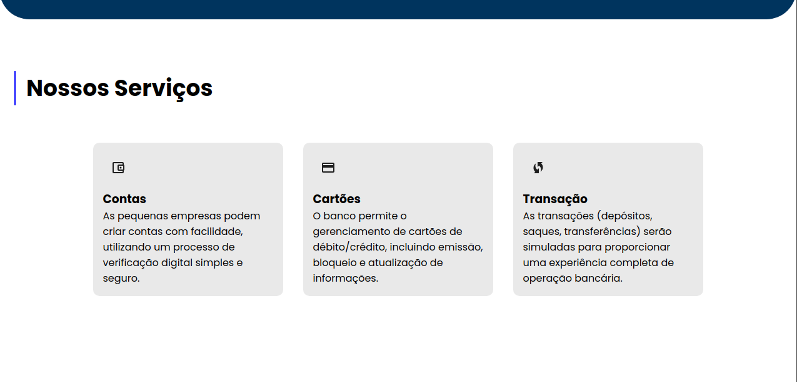
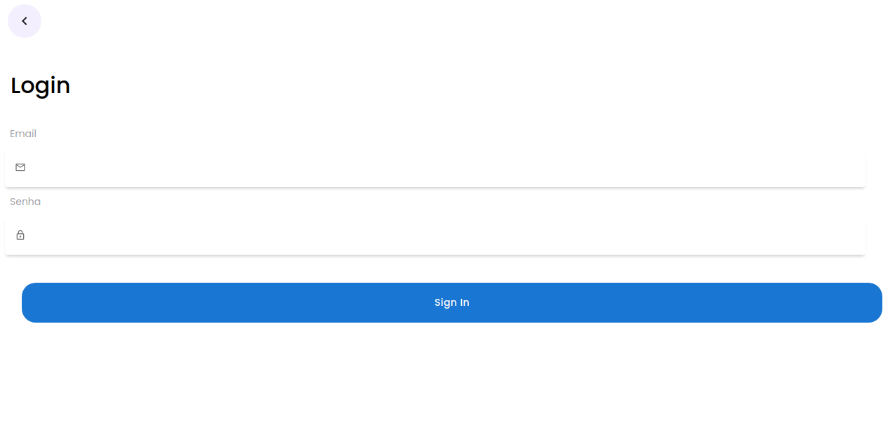
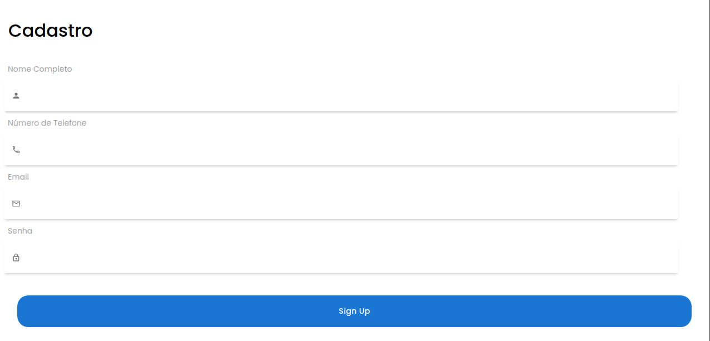
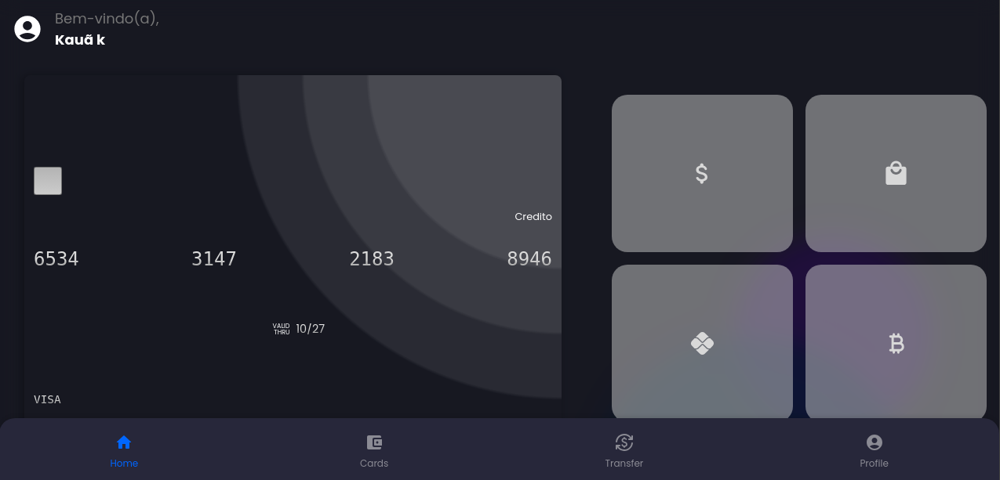
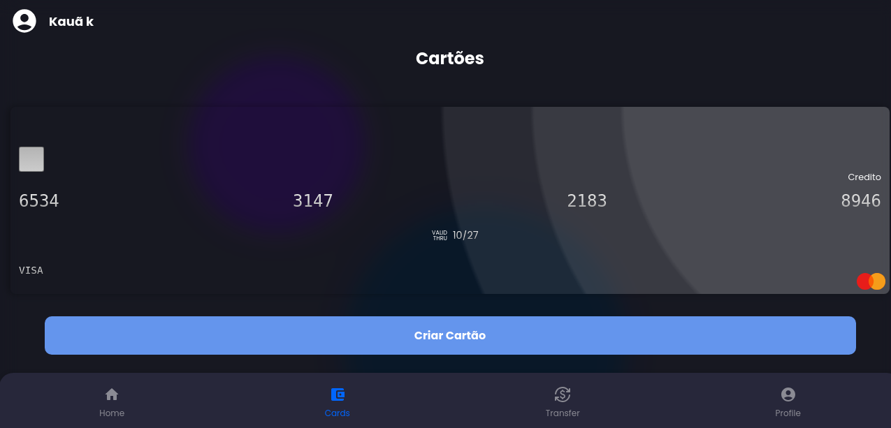
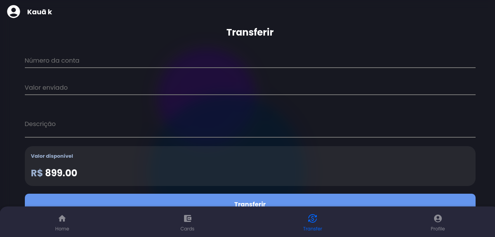
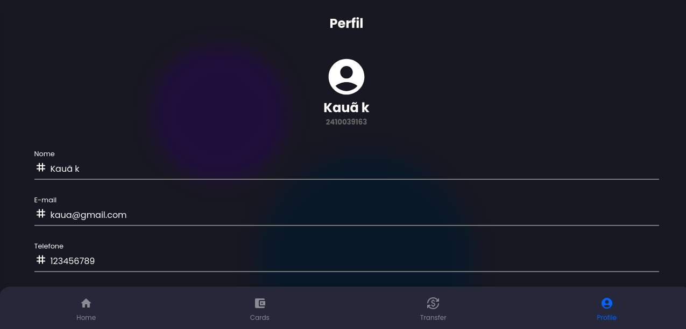

# Lunar Pay - Banco Digital 💳🔮🌙

Lunar Pay é uma aplicação digital desenvolvida para facilitar a gestão financeira dos usuários, oferecendo uma experiência completa de banco digital. A plataforma inclui tanto uma API backend robusta para o gerenciamento de transações e contas, quanto um frontend intuitivo que proporciona uma interface fácil de usar para realizar pagamentos, transferências e monitorar o saldo em tempo real.

# 📋 Tecnologias Utilizadas
* Backend: Node.js (v22.1.0), Express.js (v4.19.2), Bcryptjs(v2.4.3), Cors(v2.8.5), Jsonwebtoken(v9.0.2), Swagger-jsdoc(v6.2.8), Swagger-ui-express(v5.0.1), Sequelize(v6.37.3)
* Frontend: React.js (v18.3.1), Vite (v5.4.1), Axios (v1.7.7), react-icons(v5.3.0),  React-toastify(v10.0.6) 
* Database: PostreSQL(v8.13.0)
* Hospedagem: API hospedada no Render e frontend no Vercel
* Outras ferramentas: Axios para consumo de API, Material UI para componentes estilizados.


# 🔧 Instalação
1 - Clone o repositório do frontend:

``` 
git clone https://github.com/anacamorims/projeto-final-m5.git 
```

2 - Instale as dependências do frontend:

```
npm install
```

3 - Inicialize o servidor frontend:
```
npm run dev
```
Por padrão, o frontend estará disponível em http://localhost:5173.

# ⚙️ API 

Foi utilizada a API Lunar Pay:

Hospedada em:
https://projeto-final-m5-api.onrender.com

# 📍 Rotas da API utilizadas 

## 1. Usuários

#### Obter Usuário por ID
* Rota: ```/api/user/:id```
* Método HTTP: GET
* Descrição: Obtém os detalhes de um usuário específico com base no seu ID.

#### Criar um Novo Usuário
* Rota: ```/api/users```
* Método HTTP: POST
* Descrição: Cria um novo usuário.    

#### Atualizar Usuário por ID
* Rota: ```/api/users/:id```
* Método HTTP: PUT
* Descrição: Atualiza os detalhes de um usuário com base no ID.
* Segurança: Autenticação com JWT 

#### Deletar Usuário por ID
* Rota: ```/api/users/:id```
* Método HTTP: DELETE
* Descrição: Deleta um usuário com base no ID.
* Segurança: Autenticação com JWT 

## 2. Cartões

#### Criar um Novo Cartão para Usuário
* Rota: ```/users/:id/card```
* Método HTTP: POST
* Descrição: Cria um novo cartão associado a um usuário.

#### Obter Cartões de um Usuário
* Rota: ```/users/:id/card```
* Método HTTP: GET
* Descrição: Retorna uma lista de cartões associados a um usuário.

## 3. Transações

#### Criar uma Nova Transação
* Rota: ```/api/transactions```
* Método HTTP: POST
* Descrição:  Cria uma nova transação.
* Segurança: Autenticação com JWT

## 4. Histórico de Transações

#### Obter Histórico de Transações de um Usuário
* Rota: ```/history/{accountNumber}```
* Método HTTP: GET
* Descrição:  Obtém o histórico de transações de um usuário com base no número da conta.

## 5. Autenticação

#### Login de Usuário
* Rota: ```/api/login```
* Método HTTP: POST
* Descrição:  Autentica um usuário no sistema.


# 🖼️ Screenshots
Aqui estão algumas imagens da interface da aplicação para visualização:

Home:




Login:



Cadastro:



Dashboard:



Cartões:



Transferência:


Perfil:



#### 🖇️ Aplicação desenvolvida como Projeto Finsl para o M5 da Programadores do Amanhã
